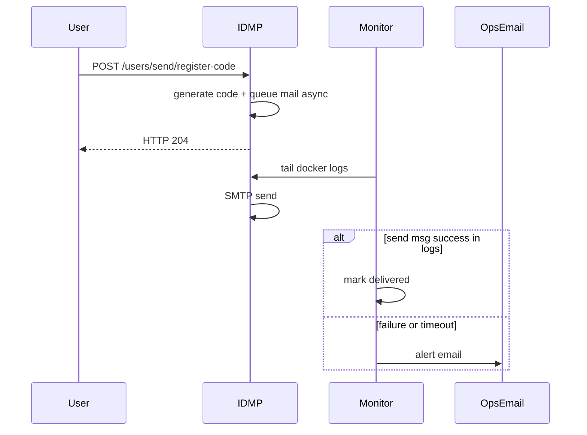

# IDMP Verification Email Monitor

Docker service that watches an IDMP container and alerts you when a **step-1 registration verification email** was requested but never confirmed as sent.

IDMP returns HTTP 204 from `POST /api/v1/users/send/register-code` before the mail worker finishes. This monitor closes that gap by tailing IDMP logs and correlating:

1. register verification code generated for an email
2. outbound SMTP attempt for that email
3. `send msg success` from the IDMP mail worker

If step 3 does not happen within the timeout, it emails your ops contact.

## What it detects

| Situation | Alert? |
|-----------|--------|
| User requests register verification code, email sends successfully | No |
| User requests code, SMTP fails in IDMP logs | Yes |
| User requests code, no SMTP attempt appears | Yes |
| User requests code, SMTP attempted but no success log | Yes |
| Optional proactive SMTP probe fails | Yes |

## Prerequisites

- Docker and Docker Compose on the same host as the IDMP container
- IDMP already running (for example `idmp-tsdb-tdgpt-idmp`)
- An SMTP account that can send alert emails to your team

## Step 1 — Clone or copy this repository

```bash
cd ~
git clone <your-repo-url> idmp-verification-email-monitor
cd idmp-verification-email-monitor
```

If you are using the local copy created on this machine:

```bash
cd ~/idmp-verification-email-monitor
```

## Step 2 — Configure environment variables

```bash
cp .env.example .env
```

Edit `.env`:

```bash
# Container name from: docker ps --filter name=idmp
IDMP_CONTAINER_NAME=idmp-tsdb-tdgpt-idmp

# Who gets alerted
ALERT_TO=you@yourcompany.com
ALERT_FROM=idmp-monitor@yourcompany.com

# SMTP for alert emails (Gmail app password, SendGrid, SES SMTP, etc.)
SMTP_HOST=smtp.gmail.com
SMTP_PORT=587
SMTP_USER=you@yourcompany.com
SMTP_PASSWORD=your-app-password
SMTP_USE_TLS=true

# How long to wait after step-1 request before alerting
VERIFY_EMAIL_TIMEOUT_SECONDS=90

# Host port for the monitor health endpoint
MONITOR_HOST_PORT=18088
```

Find your IDMP container name:

```bash
docker ps --format '{{.Names}}' | grep idmp
```

## Step 3 — Build and start the monitor container

```bash
docker compose up -d --build
```

Check health:

```bash
curl -s http://localhost:18088/health | python3 -m json.tool
```

Expected:

```json
{
  "status": "ok",
  "service": "idmp-verification-email-monitor",
  "container": "idmp-tsdb-tdgpt-idmp",
  "stats": {
    "events_seen": 0,
    "successes": 0,
    "failures": 0,
    "timeouts": 0,
    "pending_count": 0
  }
}
```

## Step 4 — Trigger a real IDMP step-1 verification request

1. Open the IDMP setup UI, usually `http://localhost:6042`
2. On the first registration step, enter an email and click **Send verification code**

Or call the API directly:

```bash
curl -i -X POST 'http://localhost:6042/api/v1/users/send/register-code' \
  -H 'Content-Type: application/json' \
  -H 'Accept-Language: en-US' \
  -d '{"email":"test@example.com"}'
```

## Step 5 — Confirm the monitor observed the flow

```bash
docker logs -f idmp-verification-monitor
```

You should see lines like:

```text
register verification requested for test@example.com
smtp send attempted for test@example.com
verification email confirmed for test@example.com
```

Refresh stats:

```bash
curl -s http://localhost:18088/health | python3 -m json.tool
```

If email delivery succeeded, `successes` increments and **no alert email** is sent.

## Step 6 — Test the failure alert path

To verify alerting works, temporarily break IDMP email settings in the UI, then request another verification code. Within `VERIFY_EMAIL_TIMEOUT_SECONDS`, the monitor should email `ALERT_TO` with:

- recipient email
- whether SMTP was attempted
- timestamp
- troubleshooting steps

You can also watch the monitor decide a timeout:

```bash
docker logs -f idmp-verification-monitor
```

## Optional: proactive SMTP connectivity probe

If you want the monitor to periodically call IDMP's built-in connectivity endpoint, set in `.env`:

```bash
PROBE_INTERVAL_SECONDS=3600
IDMP_BASE_URL=http://host.docker.internal:6042
```

Then restart:

```bash
docker compose up -d
```

## How it works



Log patterns matched inside the IDMP container:

- `Sending register verify code for user@example.com: 123456`
- `send email to user@example.com, title: Your TDengine IDMP account verification code`
- `send msg success detailId: ...`
- `send msg failed ...`

## Operations

```bash
# Start
docker compose up -d

# Logs
docker logs -f idmp-verification-monitor

# Restart after .env changes
docker compose up -d --build

# Stop
docker compose down
```

## Troubleshooting

### Monitor cannot find IDMP container

```bash
docker ps --format '{{.Names}}'
```

Set `IDMP_CONTAINER_NAME` in `.env` to the exact name.

### Monitor starts but never sees events

- Ensure the monitor container has access to `/var/run/docker.sock`
- Confirm register requests hit the same IDMP container you configured
- Check IDMP logs manually:

```bash
docker logs idmp-tsdb-tdgpt-idmp 2>&1 | grep -i 'register-code\|verify code\|send email'
```

### Alerts not received

- Verify SMTP credentials with a manual send test
- Check spam folder
- Inspect monitor logs for SMTP exceptions

### False positives on busy systems

Increase `VERIFY_EMAIL_TIMEOUT_SECONDS` if your SMTP relay is slow.

## Security notes

- The monitor needs read-only Docker socket access to stream logs.
- Store SMTP credentials in `.env`; do not commit `.env`.
- Alert emails may include the verification code from IDMP debug logs. Restrict `ALERT_TO` to trusted operators only.

## Related IDMP APIs

| Endpoint | Purpose |
|----------|---------|
| `POST /api/v1/users/send/register-code` | Step-1 registration verification code |
| `POST /api/v1/system/email/default-connectivity` | Test configured SMTP |
| `GET /api/v1/system/email/config` | Read saved email settings |

## License

Internal tooling for TDengine IDMP deployments.
