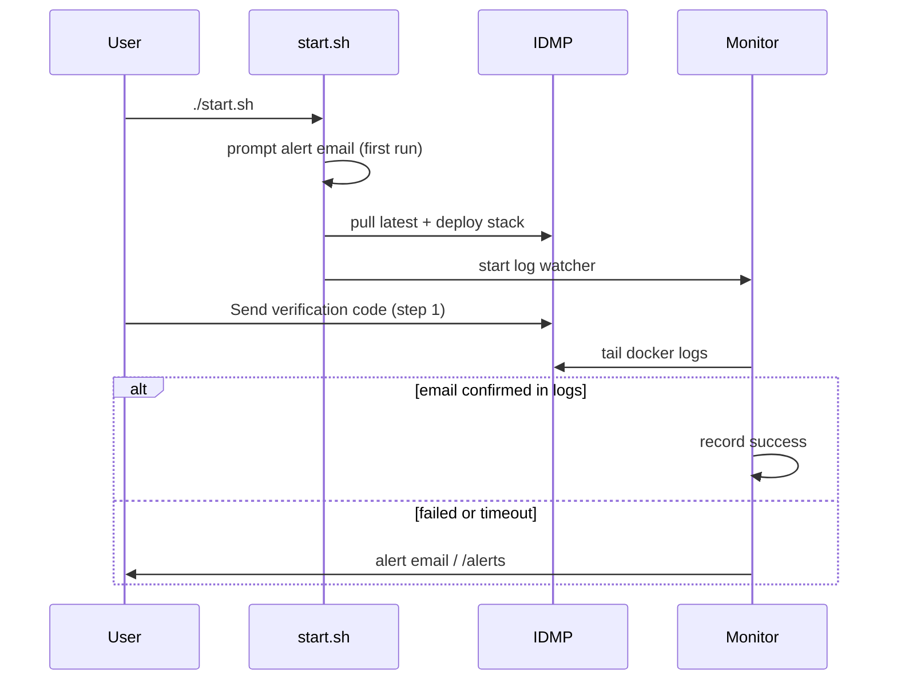

# IDMP Verification Email Monitor

One-command deployment for a **fresh IDMP + TSDB + TDGPT** stack with automatic verification-email monitoring.

No `.env` file. No manual configuration. On first run, enter the email address where you want alerts sent.

## Quick start

```bash
git clone https://github.com/arunTDengine/idmp-verification-email-monitor.git
cd idmp-verification-email-monitor
chmod +x start.sh
./start.sh
```

First run prompts:

```text
Alert email address: you@yourcompany.com
SMTP app password (hidden): [optional - press Enter to skip]
```

Then the script will:

1. Pull the **latest** `tdengine/idmp-ee`, `tdengine/tsdb-ee`, `tdengine/tdgpt-full`, and `tdengine/idmp-ai-ee` images
2. Deploy a fresh stack (TDGPT → TSDB → IDMP → IDMP AI)
3. Start the verification-email monitor automatically

## URLs after startup

| Service | URL |
|---------|-----|
| IDMP setup UI | http://localhost:6042 |
| Monitor health | http://localhost:18088/health |
| Monitor alerts | http://localhost:18088/alerts |

## What the monitor checks

When someone clicks **Send verification code** on IDMP step 1, the monitor tails IDMP logs and confirms:

1. Verification code generated
2. SMTP send attempted
3. `send msg success` logged

If delivery is not confirmed within 90 seconds, an alert is raised to your email (if SMTP password was provided) and always stored at `/alerts`.

## Fresh redeploy (wipe data)

```bash
./start.sh --fresh
```

This removes all volumes and deploys a completely clean IDMP stack.

## Daily use

```bash
./start.sh          # pull latest images and ensure stack is running
docker logs -f idmp-verification-monitor
curl http://localhost:18088/health
```

Settings are saved in `data/monitor-config.json` (created on first run). You do not need to edit any env files.

## Change alert email later

```bash
rm data/monitor-config.json
./start.sh
```

You will be prompted again on the next run.

## Optional SMTP password

If you skip the SMTP password on first run, alerts appear in:

- `docker logs idmp-verification-monitor`
- http://localhost:18088/alerts

To enable email delivery, remove `data/monitor-config.json` and run `./start.sh` again with an app password for your mailbox (Gmail app passwords work with the built-in defaults).

## Architecture



## Troubleshooting

**Port conflicts** — Stop other IDMP stacks using ports 6030–6042, or edit port mappings in `docker-compose.yml`.

**Monitor not seeing events** — Confirm IDMP container name is `idmp-monitor-idmp`:

```bash
docker ps --filter name=idmp-monitor
```

**IDMP slow to start** — First boot can take 2–3 minutes. `start.sh` waits for the health check.

## License

Internal tooling for TDengine IDMP deployments.
